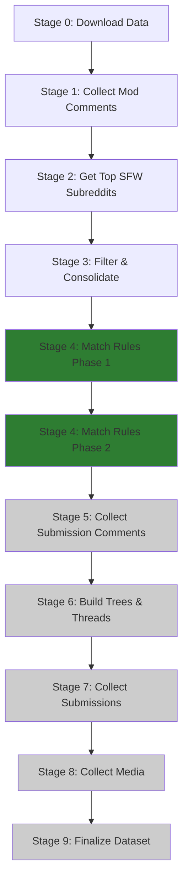
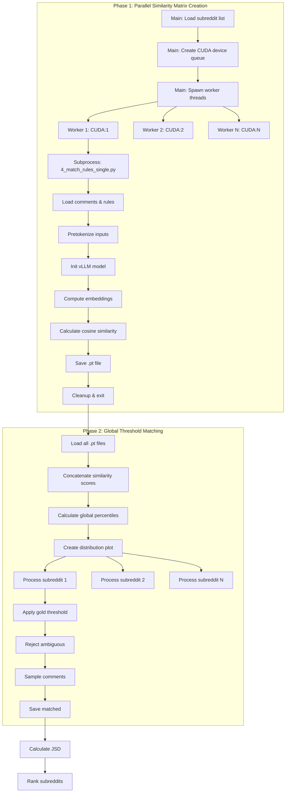

# Reddit Mod Collection Pipeline - Architecture Documentation

## 📚 **Codebase Overview**

This is a **clean, functional four-phase pipeline** for collecting and processing Reddit moderation data from Pushshift archives. The architecture follows DRY principles with **12 core scripts** across 4 phases, producing structured discussion thread pairs for moderation analysis. The system supports **parallel processing**, **streaming compression**, **embedding-based rule matching**, and **comprehensive logging**.

### **Environment Prerequisites**
```python
# Essential environment variables for embedding model
os.environ['VLLM_WORKER_MULTIPROC_METHOD'] = 'spawn'  # Prevent SIGABRT issues
os.environ['VLLM_CONFIGURE_LOGGING'] = '0'  # Disable vLLM default logging
os.environ['PYTHONHASHSEED'] = '0'  # Deterministic behavior
```

### **Architecture Files**
```
config.py                              # Configuration with DATA_FLOW mapping (~284 lines)
run_pipeline.py                        # Pipeline orchestration (~250 lines)

scripts/
├── 0_download_data.py                 # Download Pushshift archives (~297 lines)
├── 1_collect_mod_comments.py          # Extract moderator comments (~219 lines)
├── 2_get_top_sfw_subreddits.py        # Get top N SFW subreddits (~329 lines)
├── 3_filter_and_consolidate.py        # Filter and consolidate by subreddit (~383 lines)
├── 4_match_rules.py                   # Match comments to rules (~645 lines)
├── 4_match_rules_single.py            # Single subreddit subprocess (~405 lines)
├── 5_collect_submission_comments.py   # (Pending implementation)
├── 6_build_trees_and_threads.py       # (Pending implementation)
├── 7_collect_submissions.py           # (Pending implementation)
├── 8_collect_media.py                 # (Pending implementation)
└── 9_finalize_dataset.py              # (Pending implementation)

utils/
├── files.py                           # File processing utilities (~411 lines)
├── logging.py                         # Centralized logging (~159 lines)
├── reddit.py                          # Reddit-specific utilities (~260 lines)
└── stats.py                           # Statistics utilities (~110 lines)
```

---

## 🎯 **Four Pipeline Phases**

The pipeline is organized into 4 distinct phases:

| Phase | Stages | Description | Key Outputs |
|-------|--------|-------------|-------------|
| **Phase 1: Data Collection** | 0-2 | Download archives, extract mod comments, identify top subreddits | RC/RS files, mod comments, subreddit rankings |
| **Phase 2: Filtering & Matching** | 3-4 | Filter by target subreddits, match comments to rules using embeddings | Matched comments, similarity matrices, JSD rankings |
| **Phase 3: Thread Construction** | 5-6 | Collect submission comments, build comment trees and discussion threads | Comment trees, thread pairs |
| **Phase 4: Dataset Finalization** | 7-9 | Collect submission metadata, download media, create final dataset | Final dataset with media |

---

## 📋 **Function Signatures Reference**

### **config.py** - Configuration Management

#### Configuration Structure
```python
DATA_FLOW = {
    'stage0_download_data': {
        'name': str,
        'script': str,
        'input_paths': List[str],
        'output_dir': str,
        'produces': List[str]
    },
    # ... (stages 1-9)
}

# Configuration Constants
DATE_RANGE: Tuple[str, str]  # ("2005-12", "2023-02")
TOP_N_SUBREDDITS_WITH_MOD_COMMENTS: int  # 2000
SIMILARITY_THRESHOLD: float  # 0.8
GOLD_PERCENTILE: int  # 99 (top 1%)
AMBIGUOUS_PERCENTILE: int  # 95 (top 5%)
MIN_MATCHED_COMMENTS: int  # 500
MAX_MATCHED_COMMENTS: int  # 1000
EMBEDDING_MODEL: str  # "Qwen/Qwen3-Embedding-8B"
FINAL_SUBREDDITS: int  # 100
PROCESSES: int  # Auto-detect CPU count
```

#### Path Management
```python
def _generate_paths() -> Dict[str, str]
def get_stage_info(stage_num: int) -> Dict[str, Any]
def get_input_paths_for_stage(stage_num: int) -> List[str]
def get_output_path_for_stage(stage_num: int) -> str
def create_directories() -> None
def validate_stage_inputs(stage_num: int) -> Tuple[bool, str]
def print_pipeline_status() -> None
```

---

### **run_pipeline.py** - Pipeline Orchestration

#### Pipeline Control
```python
def get_stage_script(stage_num: int) -> str
def run_stage(stage_num: int, pipeline_logger: Logger = None) -> bool
def run_pipeline(start_stage: int = 0, end_stage: int = 9, stop_on_failure: bool = True) -> int
def show_usage() -> None
def main() -> int
```

---

### **scripts/0_download_data.py** - Download Pushshift Archives

#### URL Generation & Download
```python
def generate_download_urls(date_range: Tuple[str, str], logger: Logger = None) -> List[Tuple[str, str, str]]
    # Returns: List[(url, filename, file_type)]

def download_file(args: Tuple[str, str, str]) -> Dict[str, Any]
    # Returns: {filename, url, status, size_bytes, download_time, output_path}

def main() -> int
```

**URL Patterns:**
- 2005-12 to 2022-12: `https://archive.org/download/pushshift_reddit_200506_to_202212/reddit/comments/RC_YYYY-MM.zst`
- 2023-01: `https://archive.org/download/pushshift_reddit_202301/reddit/comments/RC_2023-01.zst`
- 2023-02: `https://archive.org/download/pushshift_reddit_202302/reddit/comments/RC_2023-02.zst`

---

### **scripts/1_collect_mod_comments.py** - Extract Moderator Comments

#### Comment Processing
```python
def process_comment_line(line: str, subreddit_counts: Dict = None) -> bool
    # Fast pre-filter: checks for '"distinguished":"moderator"' and '"parent_id":"t1_'

def process_single_file(file_path: str) -> Dict[str, Any]
    # Returns: {file, output, subreddit_counts, lines_processed, lines_matched}

def collect_subreddit_stats(results: List[Dict], logger: Logger) -> Dict[str, int]
def generate_rankings(subreddit_counts: Dict[str, int]) -> Dict[str, Any]
def main() -> int
```

**Key Features:**
- Filters bots and AutoModerator
- Only includes comments replying to other comments (`parent_id` starts with `t1_`)
- Collects subreddit statistics during processing (no re-reading)
- Parallel processing with per-file loggers

---

### **scripts/2_get_top_sfw_subreddits.py** - Get Top SFW Subreddits

#### Reddit API Integration
```python
def initialize_reddit_client(logger: Logger) -> Optional[praw.Reddit]
def check_nsfw_status(reddit: praw.Reddit, subreddit_name: str, logger: Logger) -> bool
def extract_subreddit_data(reddit: praw.Reddit, subreddit_name: str,
                          original_rank: int, mod_comment_count: int,
                          logger: Logger) -> Optional[Dict[str, Any]]
def extract_community_rules(reddit: praw.Reddit, subreddit_name: str,
                            logger: Logger) -> List[Dict[str, Any]]
def process_subreddit_with_retry(reddit: praw.Reddit, subreddit_name: str,
                                 original_rank: int, mod_comment_count: int,
                                 logger: Logger) -> Optional[Dict[str, Any]]
def collect_sfw_subreddits(rankings_data: Dict, reddit: praw.Reddit,
                           logger: Logger) -> List[Dict[str, Any]]
def main() -> int
```

**Rule Data Structure:**
```python
{
    'subreddit': str,
    'rule_index': int,
    'short_name': str,
    'description': str,
    'violation_reason': str,
    'short_name_clean': str,           # Cleaned version (no markdown, URLs)
    'description_clean': str,          # Cleaned version
    'violation_reason_clean': str,     # Cleaned version
    'rule_comprehensive': str          # Combined text for embeddings
}
```

---

### **scripts/3_filter_and_consolidate.py** - Filter and Consolidate

#### Three-Phase Architecture
```python
def load_target_subreddits(logger: Logger) -> Set[str]
def process_single_file(args: Tuple[str, Set[str]]) -> Dict[str, Any]
    # Phase 1: Filter RC files to temp subreddit subdirs
def consolidate_subreddit(args: Tuple[str, Set[str]]) -> Dict[str, Any]
    # Phase 2: Consolidate temp files per subreddit chronologically
def cleanup_temp_files(logger: Logger) -> None
    # Phase 3: Remove temp directories
def main() -> int
```

**Processing Flow:**
1. **Phase 1**: Stream each RC file → filter for target subreddits → write to `temp/{subreddit}/RC_{date}_mod_comments.zst`
2. **Phase 2**: For each subreddit → read all temp files in chronological order → consolidate to `{subreddit}_mod_comments.jsonl.zst`
3. **Phase 3**: Clean up temp directories

---

### **scripts/4_match_rules.py** - Match Comments to Rules (Two-Phase)

#### Phase 1: Similarity Matrix Generation
```python
def extract_submission_ids(comments: List[Dict[str, Any]]) -> List[str]
def is_cuda_memory_available(device_id: int, threshold: float = 0.85) -> bool
def get_available_cuda_devices() -> List[int]
def create_distribution_plot(output_dir: str, all_similarities: np.ndarray,
                             gold_percentile: int, ambiguous_percentile: int,
                             logger: Logger = None) -> Tuple[float, float]
```

#### Phase 2: Global Threshold Application
```python
def load_similarity_matrix(matrix_file: str) -> Dict[str, Any]
def process_subreddit_matching(load_result: Dict, logger: Logger = None) -> Dict[str, Any]
def main() -> int
```

**Two-Phase Processing:**

**Phase 1: Parallel Similarity Matrix Creation**
- Spawns subprocess per subreddit using `4_match_rules_single.py`
- Dynamic CUDA device assignment via queue-based worker pool
- Each subprocess:
  1. Loads comments and rules
  2. Pretokenizes inputs to determine optimal `max_model_len`
  3. Initializes vLLM embedding model
  4. Computes cosine similarity matrix (comments × rules)
  5. Saves matrix to `.pt` file
  6. Explicit cleanup to avoid vLLM SIGABRT issues

**Phase 2: Global Threshold Matching**
- Loads all similarity matrices sequentially
- Computes global percentile thresholds from all similarity scores
- Creates distribution plot with gold (99th) and ambiguous (95th) thresholds
- Processes each subreddit sequentially:
  1. Applies gold threshold for matching
  2. Rejects ambiguous matches (multiple rules above ambiguous threshold)
  3. Samples up to `MAX_MATCHED_COMMENTS` (1000) comments
  4. Extracts submission IDs for Stage 5
  5. Saves matched comments and statistics
- Calculates JSD from uniform distribution
- Ranks subreddits by JSD (lower = more uniform rule distribution)

**CLI Options:**
```bash
python scripts/4_match_rules.py                # Full two-phase processing
python scripts/4_match_rules.py --phase2-only  # Skip Phase 1, use existing .pt files
```

---

### **scripts/4_match_rules_single.py** - Single Subreddit Subprocess

#### Embedding Model Initialization
```python
class SimpleCommentRuleMatcher:
    def __init__(self, model_name: str = None, max_model_len: int = 2048)

    @staticmethod
    def save_similarity_matrix(cosine_similarities: torch.Tensor, comments: List,
                               rules: List, subreddit_name: str) -> None

    def calculate_similarities_pretokenized(self, comments: List, rules: List,
                                           tokenized_comments: List,
                                           tokenized_rules: List) -> bool

    @classmethod
    def pretokenize_inputs(cls, comments: List, rules: List, model_name: str,
                          task_description: str) -> Tuple[List, List, int]
        # Returns: tokenized_comments, tokenized_rules, max_length

def main() -> int
```

**Key Features:**
- Deterministic embeddings (`torch.manual_seed(0)`, `PYTHONHASHSEED=0`)
- Pretokenization to optimize `max_model_len`
- vLLM logger redirection to subreddit-specific log files
- Explicit cleanup to prevent SIGABRT on process exit

---

### **utils/files.py** - File Processing Utilities

#### Compression & Streaming
```python
def read_and_decode(reader, chunk_size: int = 2**24, max_window_size: int = 2**30,
                   previous_chunk: bytes = None, bytes_read: int = 0) -> str
    # Recursive decompression with error handling

def process_zst_file(input_file: str, output_file: str,
                    line_processor: Callable[[str], bool],
                    progress_interval: int = 10_000_000,
                    logger: Logger = None) -> Dict[str, int]
    # Single-output streaming processor

def process_zst_file_multi(input_file: str,
                          line_processor: Callable[[str, Dict], Dict[str, Any]],
                          processor_state: Dict[str, Any],
                          progress_interval: int = 10_000_000,
                          logger: Logger = None) -> Dict[str, int]
    # Multi-output streaming processor with state
    # line_processor returns: {'matched': bool, 'output_files': List[str], 'data': Any}

def read_zst_lines(file_path: str, max_lines: int = None) -> List[str]
def write_zst_lines(file_path: str, lines: List[str], level: int = 3, threads: int = 4)
def write_zst_json_objects(file_path: str, objects: List[Any], level: int = 3, threads: int = 4)
```

#### JSON Parsing (with Fallback)
```python
# Priority: orjson > ujson > json
json_loads: Callable[[str], Any]
json_dumps: Callable[[Any], str]
json_dumps_pretty: Callable[[Any], str]
```

#### File Management
```python
def write_json_file(data: Any, file_path: str, pretty: bool = False)
def read_json_file(file_path: str) -> Any
def get_files_in_date_range(folder: str, prefix: str, date_range: Tuple[str, str],
                            logger: Logger = None) -> List[str]
def process_files_parallel(files: List, process_func: Callable, processes: int = None,
                          logger: Logger = None) -> List[Any]
def get_file_size_gb(file_path: str) -> float
def ensure_directory(file_path: str)
```

---

### **utils/logging.py** - Centralized Logging

#### Logger Setup
```python
def setup_stage_logger(stage_name: str, log_level: str = "INFO",
                      worker_identifier: str = None) -> Logger
    # Creates stage-specific directories with main/worker separation

def get_stage_logger(stage_num: int, stage_description: str = None,
                    worker_identifier: str = None) -> Logger
```

**Logging Structure:**
```
logs/
├── stage1_collect_mod_comments/
│   ├── main_20250109_143022.log        # Main process log
│   ├── RC_2023-02_20250109_143022.log  # Worker log (RC file)
│   └── RC_2023-01_20250109_143022.log  # Worker log (RC file)
├── stage4_match_rules/
│   ├── main_20250109_150000.log
│   └── subreddits/                     # Subdirectory for subreddit logs
│       ├── askreddit_20250109_150000.log
│       └── pics_20250109_150000.log
└── pipeline_runner/
    └── main_20250109_140000.log
```

#### Logging Helpers
```python
def log_stage_start(logger: Logger, stage_num: int, stage_name: str)
def log_stage_end(logger: Logger, stage_num: int, success: bool = True, elapsed_time: float = None)
def log_progress(logger: Logger, current: int, total: int, item_name: str = "items")
def log_stats(logger: Logger, stats_dict: Dict, title: str = "Statistics")
def log_error_and_continue(logger: Logger, error: Exception, context: str = "")
def log_file_operation(logger: Logger, operation: str, file_path: str, success: bool = True)
```

---

### **utils/reddit.py** - Reddit-Specific Utilities

#### Filtering & Validation
```python
def is_bot_or_automoderator(author: str) -> bool
def is_moderator_comment(comment: Dict[str, Any]) -> bool
def validate_comment_structure(comment: Dict[str, Any]) -> bool
def validate_submission_structure(submission: Dict[str, Any]) -> bool
def filter_reddit_line(line: str, check_func: Callable) -> bool
```

#### ID Extraction
```python
def extract_submission_id(link_id: str) -> Optional[str]  # "t3_abc123" -> "abc123"
def extract_comment_id(parent_id: str) -> Optional[str]   # "t1_abc123" -> "abc123"
def normalize_subreddit_name(subreddit: str) -> str       # "r/AskReddit" -> "askreddit"
```

#### Text Cleaning
```python
def clean_rule_text(text: str) -> str
    # Removes:
    # - HTML entities & tags
    # - Markdown links, emphasis, headers, code blocks
    # - URLs
    # - Rule prefixes ("Rule 1:", "General:")
    # - Extra whitespace
```

#### Media Detection
```python
def has_media(submission: Dict[str, Any]) -> bool
    # Checks: is_video, media, post_hint, URL patterns (i.redd.it, imgur, youtube)
```

#### Statistics
```python
def build_subreddit_stats(comments: List[Dict]) -> Dict[str, int]
```

---

### **utils/stats.py** - Statistics Utilities

#### Jensen-Shannon Divergence
```python
def calculate_jsd_from_uniform(distribution: Dict[str, int]) -> float
    # Returns: 0.0 = perfectly uniform, 1.0 = maximum divergence
    # Used to rank subreddits by rule distribution quality
```

#### Generic Ranking
```python
def rank_by_score(items: List[Dict], score_key: str, ascending: bool = True,
                 filter_func: Callable = None) -> List[Dict]
    # Adds 'rank' field to items, filtered items get rank=999999
```

#### Rule Analysis
```python
def analyze_rule_distribution(stats_list: List[Dict],
                             rule_matches_key: str = 'rule_matches') -> Dict
    # Returns: {total_rules, rule_distribution, top_rules, total_matches}
```

---

## 🔄 **Core Workflows**

### **Complete Pipeline Flow (Stages 0-4 Implemented)**



### **Stage 4 Two-Phase Processing Detail**



---

## 🎯 **Key Design Patterns**

### **1. DATA_FLOW Configuration Pattern**
```python
# Single source of truth for pipeline dependencies
DATA_FLOW = {
    'stage3_filter_and_consolidate': {
        'input_paths': ['mod_comments'],
        'input_files': ['stage2_top_2000_sfw_subreddits.json'],
        'output_dir': 'top_subreddits',
        'produces': ['{subreddit}_mod_comments.jsonl.zst']
    }
}

# Automatic path resolution
input_paths = get_input_paths_for_stage(3)
output_path = get_output_path_for_stage(3)
valid, msg = validate_stage_inputs(3)
```

### **2. Streaming Multi-Output Pattern**
```python
# Used in Stage 3: Filter to multiple subreddit temp files
def comment_processor(line: str, state: Dict) -> Dict[str, Any]:
    comment = json_loads(line)
    subreddit = normalize_subreddit_name(comment.get('subreddit'))

    if subreddit in target_subreddits:
        output_file = f"temp/{subreddit}/RC_{date}_mod_comments.zst"
        return {
            'matched': True,
            'output_files': [output_file],  # Can specify multiple outputs
            'data': comment
        }
    return {'matched': False}

# Lazy-open writers for each output file
process_zst_file_multi(input_file, comment_processor, state={})
```

### **3. Worker Logger Pattern**
```python
# Main process logger
logger = get_stage_logger(1, "collect_mod_comments")

# Worker logger with meaningful identifier
def process_single_file(file_path: str):
    rc_filename = os.path.basename(file_path).replace('.zst', '')  # "RC_2023-02"
    worker_logger = get_stage_logger(1, "collect_mod_comments", worker_identifier=rc_filename)
    worker_logger.info(f"Processing {rc_filename}...")
    # Creates: logs/stage1_collect_mod_comments/RC_2023-02_20250109_143022.log
```

### **4. Two-Phase Architecture Pattern**
**Stage 3:** Filter → Consolidate → Cleanup
**Stage 4:** Similarity Matrices → Global Thresholds → Matching

This pattern separates:
1. **Phase 1**: Data generation (parallel, memory-intensive)
2. **Phase 2**: Data aggregation/processing (sequential or parallel, uses Phase 1 outputs)

Benefits:
- Avoids memory exhaustion
- Enables global statistics computation
- Fault tolerance (Phase 1 failures don't block other subreddits)

### **5. Subprocess Isolation Pattern**
```python
# Stage 4: Spawn isolated subprocesses for vLLM to avoid multiprocessing issues
def run_single_subreddit(subreddit_name, cuda_device):
    cmd = [sys.executable, 'scripts/4_match_rules_single.py',
           '--subreddit', subreddit_name,
           '--cuda-device', str(cuda_device)]
    result = subprocess.run(cmd, timeout=3600)
    return result.returncode == 0

# CUDA queue-based worker pool
def worker_with_cuda(cuda_device):
    results = []
    while True:
        try:
            subreddit_name = subreddit_queue.get(timeout=1)
        except queue.Empty:
            break

        if is_cuda_memory_available(cuda_device):
            result = run_single_subreddit(subreddit_name, cuda_device)
        else:
            result = {"error": "CUDA memory not available"}
        results.append(result)
    return results

with ThreadPoolExecutor(max_workers=len(cuda_devices)) as executor:
    futures = {executor.submit(worker_with_cuda, dev): dev for dev in cuda_devices}
```

### **6. Fast Pre-Filter Pattern**
```python
# Stage 1: Fast string check before JSON parsing (10x speedup)
def process_comment_line(line: str, subreddit_counts: dict = None) -> bool:
    # Quick pre-filter before JSON parsing
    if not ('"distinguished":"moderator"' in line and '"parent_id":"t1_' in line):
        return False

    # Only parse JSON if pre-filter passes
    def check_comment(comment):
        if not is_moderator_comment(comment):
            return False
        # ... additional checks

    return filter_reddit_line(line, check_comment)
```

### **7. Hierarchical Output Structure**
```
output/
├── matched_comments/               # Stage 4 outputs
│   ├── askreddit_similarity_matrix.pt
│   ├── askreddit_match.jsonl.zst
│   ├── askreddit_stats.json
│   └── cosine_similarity_distribution_all_percentiles.png
├── organized_comments/             # Stage 5 outputs
├── comment_trees/                  # Stage 6 outputs
└── final_dataset/                  # Stage 9 outputs

data/
├── stage1_subreddit_mod_comment_rankings.json
├── stage2_top_2000_sfw_subreddits.json
├── stage3_filter_and_consolidate_summary.json
├── stage4_matching_summary.json
└── subreddit_submission_ids.json

logs/
├── stage1_collect_mod_comments/
│   ├── main_20250109_143022.log
│   └── RC_2023-02_20250109_143022.log
└── stage4_match_rules/
    ├── main_20250109_150000.log
    └── subreddits/
        └── askreddit_20250109_150000.log
```

### **8. In-Memory Statistics Collection**
```python
# Stage 1: Collect statistics during processing (no re-reading)
def process_single_file(file_path: str) -> dict:
    subreddit_counts = defaultdict(int)

    def process_line_with_stats(line: str) -> bool:
        # Collect stats during streaming (closure captures subreddit_counts)
        result = process_comment_line(line, subreddit_counts)
        return result

    stats = process_zst_file(input_file, output_file, process_line_with_stats)

    return {
        **stats,
        'subreddit_counts': dict(subreddit_counts)  # Return stats without re-reading
    }
```

---

## 🧪 **Usage Examples**

### **Pipeline Orchestration**

```bash
# Show pipeline status
python run_pipeline.py status

# Run full pipeline (stages 0-9)
python run_pipeline.py

# Run single stage
python run_pipeline.py 0         # Download data only
python run_pipeline.py 4         # Match rules only

# Run stage range
python run_pipeline.py 3 5       # Stages 3, 4, 5

# Show help
python run_pipeline.py help
```

### **Stage 0: Download Data**

```bash
# Download Pushshift archives for date range in config.py
python scripts/0_download_data.py
```

**Configuration:**
```python
# config.py
DATE_RANGE = ("2005-12", "2023-02")  # Inclusive range
```

**Output:**
- `reddit_comments/RC_YYYY-MM.zst` (comment files)
- `reddit_submissions/RS_YYYY-MM.zst` (submission files)
- `logs/stage0_download_log.json` (download statistics)

### **Stage 1: Collect Moderator Comments**

```bash
# Extract moderator comments from RC files
python scripts/1_collect_mod_comments.py
```

**Output:**
- `mod_comments/RC_YYYY-MM_mod_comments.zst` (one per RC file)
- `data/stage1_subreddit_mod_comment_rankings.json` (subreddit rankings)

**Example Rankings Output:**
```json
{
  "summary": {
    "total_subreddits": 45000,
    "total_mod_comments": 12500000,
    "collection_date": "2025-01-09 14:30:22"
  },
  "rankings": [
    {"rank": 1, "subreddit": "askreddit", "mod_comment_count": 150000},
    {"rank": 2, "subreddit": "pics", "mod_comment_count": 120000}
  ]
}
```

### **Stage 2: Get Top SFW Subreddits**

```bash
# Requires Reddit API credentials
export REDDIT_CLIENT_ID="your_client_id"
export REDDIT_CLIENT_SECRET="your_client_secret"
export REDDIT_USER_AGENT="reddit-mod-pipeline:v1.0"

python scripts/2_get_top_sfw_subreddits.py
```

**Configuration:**
```python
# config.py
TOP_N_SUBREDDITS_WITH_MOD_COMMENTS = 2000
```

**Output:**
- `data/stage2_top_2000_sfw_subreddits.json`

**Example Output Structure:**
```json
{
  "summary": {
    "total_collected": 2000,
    "target_count": 2000,
    "reddit_api_used": true
  },
  "subreddits": [
    {
      "subreddit": {
        "name": "AskReddit",
        "display_name": "AskReddit",
        "over18": false,
        "subscribers": 45000000,
        "mod_comment_count": 150000,
        "mod_comment_rank": 1,
        "sfw_rank": 1
      },
      "rules": [
        {
          "rule_index": 1,
          "short_name": "Post must be a clear question",
          "description": "All posts must be a clear, direct question...",
          "short_name_clean": "Post must be a clear question",
          "description_clean": "All posts must be a clear, direct question...",
          "rule_comprehensive": "Short Name: Post must be a clear question\nDescription: All posts must be a clear, direct question..."
        }
      ]
    }
  ]
}
```

### **Stage 3: Filter and Consolidate**

```bash
# Filter mod comments for top N subreddits
python scripts/3_filter_and_consolidate.py
```

**Three-Phase Process:**
1. **Phase 1**: Filter RC files → temp subreddit subdirs
2. **Phase 2**: Consolidate temp files per subreddit chronologically
3. **Phase 3**: Clean up temp directories

**Output:**
- `top_subreddits/askreddit_mod_comments.jsonl.zst`
- `top_subreddits/pics_mod_comments.jsonl.zst`
- `data/stage3_filter_and_consolidate_summary.json`

### **Stage 4: Match Rules**

```bash
# Full two-phase processing
python scripts/4_match_rules.py

# Skip Phase 1 (use existing .pt files)
python scripts/4_match_rules.py --phase2-only
```

**Configuration:**
```python
# config.py
EMBEDDING_MODEL = "Qwen/Qwen3-Embedding-8B"
GOLD_PERCENTILE = 99          # Top 1% similarity scores
AMBIGUOUS_PERCENTILE = 95     # Top 5% similarity scores
MIN_MATCHED_COMMENTS = 500    # Minimum matches for JSD ranking
MAX_MATCHED_COMMENTS = 1000   # Sample size per subreddit
```

**Phase 1 Output:**
- `matched_comments/askreddit_similarity_matrix.pt` (PyTorch format)
- Intermediate stats in `matched_comments/askreddit_stats.json`

**Phase 2 Output:**
- `matched_comments/askreddit_match.jsonl.zst` (matched comments)
- `matched_comments/askreddit_stats.json` (updated with JSD, rank)
- `matched_comments/cosine_similarity_distribution_all_percentiles.png`
- `data/stage4_matching_summary.json` (global statistics)
- `data/subreddit_submission_ids.json` (for Stage 5)

**Example Matched Comment:**
```json
{
  "id": "abc123",
  "author": "ModeratorName",
  "body": "Your post has been removed...",
  "body_clean": "Your post has been removed...",
  "subreddit": "askreddit",
  "created_utc": 1640000000,
  "matched_rule": {
    "rule_index": 1,
    "short_name": "Post must be a clear question",
    "description": "All posts must be a clear, direct question...",
    "similarity_score": 0.8765
  }
}
```

**Example Summary Output:**
```json
{
  "total_subreddits_processed": 1800,
  "successful_subreddits": 1750,
  "total_comments": 25000000,
  "total_matched": 5000000,
  "overall_match_rate": 20.0,
  "gold_threshold": 0.7234,
  "ambiguous_threshold": 0.6891,
  "embedding_model": "Qwen/Qwen3-Embedding-8B",
  "subreddit_stats": [
    {
      "rank": 1,
      "subreddit": "askreddit",
      "jsd_from_uniform": 0.0234,
      "matched_comments": 1000,
      "match_percentage": 15.5,
      "total_rules": 8
    }
  ]
}
```

### **Debug Mode Testing**

```bash
# Test with limited data (edit DATE_RANGE in config.py)
DATE_RANGE = ("2023-01", "2023-01")  # Single month
TOP_N_SUBREDDITS_WITH_MOD_COMMENTS = 100

# Run pipeline
python run_pipeline.py 0 4
```

---

## 📊 **Output Structure**

### **Directory Hierarchy**

```
reddit-mod-collection-pipeline/
├── config.py
├── run_pipeline.py
├── scripts/
│   ├── 0_download_data.py
│   ├── 1_collect_mod_comments.py
│   ├── 2_get_top_sfw_subreddits.py
│   ├── 3_filter_and_consolidate.py
│   ├── 4_match_rules.py
│   └── 4_match_rules_single.py
├── utils/
│   ├── files.py
│   ├── logging.py
│   ├── reddit.py
│   └── stats.py
├── data/                                              # Stage outputs & summaries
│   ├── stage1_subreddit_mod_comment_rankings.json
│   ├── stage2_top_2000_sfw_subreddits.json
│   ├── stage3_filter_and_consolidate_summary.json
│   ├── stage4_matching_summary.json
│   ├── subreddit_submission_ids.json
│   ├── mod_comments/                                  # Stage 1
│   │   ├── RC_2023-02_mod_comments.zst
│   │   └── RC_2023-01_mod_comments.zst
│   ├── top_subreddits/                                # Stage 3
│   │   ├── askreddit_mod_comments.jsonl.zst
│   │   └── pics_mod_comments.jsonl.zst
│   └── submissions/                                   # Stage 7 (pending)
├── output/
│   ├── matched_comments/                              # Stage 4
│   │   ├── askreddit_similarity_matrix.pt
│   │   ├── askreddit_match.jsonl.zst
│   │   ├── askreddit_stats.json
│   │   └── cosine_similarity_distribution_all_percentiles.png
│   ├── organized_comments/                            # Stage 5 (pending)
│   ├── comment_trees/                                 # Stage 6 (pending)
│   ├── media/                                         # Stage 8 (pending)
│   └── final_dataset/                                 # Stage 9 (pending)
└── logs/
    ├── stage0_download_data/
    │   └── main_20250109_140000.log
    ├── stage1_collect_mod_comments/
    │   ├── main_20250109_143022.log
    │   └── RC_2023-02_20250109_143022.log
    ├── stage4_match_rules/
    │   ├── main_20250109_150000.log
    │   └── subreddits/
    │       └── askreddit_20250109_150000.log
    └── pipeline_runner/
        └── main_20250109_140000.log
```

---

## 🔧 **Configuration Reference**

### **Base Directories**
```python
# config.py - Edit these for your environment
BASE_DATA = "/data3/zkachwal/reddit-mod-collection-pipeline"
REDDIT_DATA = "/gpfs/slate-cnets/datasets/reddit/comments_submissions"
```

### **Processing Settings**
```python
DATE_RANGE = ("2005-12", "2023-02")              # Pushshift archive range
TOP_N_SUBREDDITS_WITH_MOD_COMMENTS = 2000        # Stage 2 target
SIMILARITY_THRESHOLD = 0.8                        # (Deprecated, now uses percentiles)
GOLD_PERCENTILE = 99                              # Top 1% = gold matches
AMBIGUOUS_PERCENTILE = 95                         # Top 5% = ambiguous threshold
MIN_MATCHED_COMMENTS = 500                        # Min for JSD ranking
MAX_MATCHED_COMMENTS = 1000                       # Sample size per subreddit
EMBEDDING_MODEL = "Qwen/Qwen3-Embedding-8B"       # Embedding model
FINAL_SUBREDDITS = 100                            # Final dataset size
PROCESSES = multiprocessing.cpu_count()           # Parallel workers
```

### **Auto-Generated Paths**
```python
PATHS = {
    'reddit_comments': f"{REDDIT_DATA}/comments",
    'reddit_submissions': f"{REDDIT_DATA}/submissions",
    'data': f"{BASE_DATA}/data",
    'logs': f"{BASE_DATA}/logs",
    'mod_comments': f"{BASE_DATA}/data/mod_comments",
    'top_subreddits': f"{BASE_DATA}/data/top_subreddits",
    'matched_comments': f"{BASE_DATA}/output/matched_comments",
    'organized_comments': f"{BASE_DATA}/output/organized_comments",
    'comment_trees': f"{BASE_DATA}/output/comment_trees",
    'submissions': f"{BASE_DATA}/data/submissions",
    'media': f"{BASE_DATA}/output/media",
    'final_dataset': f"{BASE_DATA}/output/final_dataset"
}
```

---

## 🚀 **Future Extensions**

### **Stages 5-9 (Planned)**

**Stage 5: Collect Submission Comments**
- Input: `subreddit_submission_ids.json`, RC files
- Process: Extract all comments for target submissions
- Output: `organized_comments/{subreddit}_submission_comments.pkl`

**Stage 6: Build Comment Trees and Discussion Threads**
- Input: Organized comments, matched comments
- Process: Build comment trees, create discussion thread pairs (mod comment + parent comment)
- Output: `comment_trees/{subreddit}_comment_trees.pkl`, `comment_trees/{subreddit}_discussion_threads.pkl`

**Stage 7: Collect Submissions**
- Input: Discussion threads, RS files
- Process: Extract submission objects for discussion threads
- Output: `submissions/{subreddit}_submissions.zst`

**Stage 8: Collect Media**
- Input: Submissions
- Process: Download media files (images, videos) from submissions
- Output: `media/{subreddit}/{submission_id}.{ext}`

**Stage 9: Finalize Dataset**
- Input: Discussion threads, submissions, media
- Process: Combine all data into final structured dataset
- Output: `final_dataset/reddit_moderation_dataset.pkl`, manifest JSON

### **Potential Improvements**

1. **Distributed Processing**
   - Multi-machine support for Stage 4 (embedding generation)
   - Hadoop/Spark integration for very large datasets

2. **Caching Layer**
   - Cache Reddit API responses
   - Cache embedding model outputs

3. **Quality Metrics**
   - Inter-rater reliability for rule matching
   - Confidence scores for matches
   - Automated quality assessment

4. **Alternative Matching Strategies**
   - Fine-tuned classification models
   - Hybrid rule-based + embedding approaches
   - Active learning for ambiguous cases

5. **Visualization Tools**
   - Interactive rule distribution explorer
   - Subreddit comparison dashboards
   - Temporal analysis of moderation patterns

---

## 📈 **Performance Characteristics**

### **Stage 1: Collect Mod Comments**
- **Throughput**: ~500K-1M lines/sec per process (depends on I/O)
- **Parallelism**: One process per RC file
- **Memory**: ~500MB per process
- **Bottleneck**: Disk I/O (reading compressed archives)

### **Stage 3: Filter and Consolidate**
- **Phase 1 Throughput**: ~300K-800K lines/sec per process
- **Phase 2 Throughput**: ~1M-2M lines/sec per subreddit
- **Parallelism**: Phase 1 (by RC file), Phase 2 (by subreddit)
- **Memory**: ~1GB per process
- **Bottleneck**: Disk I/O (multi-output writes in Phase 1)

### **Stage 4: Match Rules**
- **Phase 1 Throughput**: Varies by GPU, typically 5-20 subreddits/GPU/hour
- **Phase 2 Throughput**: ~100-200 subreddits/minute (CPU-bound)
- **Parallelism**: Phase 1 (by CUDA device), Phase 2 (sequential)
- **Memory**: Phase 1 (~10-20GB VRAM per GPU), Phase 2 (~5GB RAM)
- **Bottleneck**: Phase 1 (GPU compute), Phase 2 (similarity matrix I/O)

### **Typical Runtime (Full Pipeline, Stages 0-4)**
- **Stage 0**: 10-50 hours (depends on network speed, ~1-2TB download)
- **Stage 1**: 5-15 hours (208 RC files, ~500GB compressed)
- **Stage 2**: 2-5 hours (API rate limiting, 2000 subreddits)
- **Stage 3**: 3-8 hours (filtering + consolidation)
- **Stage 4**: 20-40 hours (Phase 1: 1800 subreddits, 4 GPUs; Phase 2: 10 minutes)
- **Total**: ~40-120 hours (depends on hardware, network, dataset size)

---

## 🧩 **Data Structures**

### **Comment Object**
```python
{
    'id': str,                      # Reddit comment ID
    'author': str,                  # Username
    'body': str,                    # Raw comment text
    'body_clean': str,              # Cleaned text (no markdown, URLs)
    'subreddit': str,               # Subreddit name (normalized lowercase)
    'created_utc': int,             # Unix timestamp
    'parent_id': str,               # "t1_<comment_id>" or "t3_<submission_id>"
    'link_id': str,                 # "t3_<submission_id>"
    'distinguished': str,           # "moderator" for mod comments
    'removal_reason': str,          # Optional removal reason
    'removal_reason_clean': str,    # Cleaned removal reason
    'score': int,                   # Comment score
    'edited': bool or int,          # False or edit timestamp
}
```

### **Rule Object**
```python
{
    'subreddit': str,
    'rule_index': int,              # 1-based index
    'short_name': str,              # Original short name
    'description': str,             # Original description
    'violation_reason': str,        # Original violation reason
    'short_name_clean': str,        # Cleaned (no markdown, URLs, prefixes)
    'description_clean': str,       # Cleaned
    'violation_reason_clean': str,  # Cleaned
    'rule_comprehensive': str       # Combined text for embeddings
}
```

### **Matched Comment Object**
```python
{
    # All fields from Comment Object, plus:
    'matched_rule': {
        'rule_index': int,
        'short_name': str,
        'description': str,
        'similarity_score': float   # Cosine similarity (0-1)
    }
}
```

### **Subreddit Stats Object**
```python
{
    'subreddit': str,
    'rank': int,                    # JSD ranking (1 = best)
    'jsd_from_uniform': float,      # 0.0 = uniform, 1.0 = max divergence
    'total_comments': int,
    'total_rules': int,
    'matched_comments': int,
    'ambiguous_matches': int,
    'match_percentage': float,
    'rule_matches': {
        '1': int,  # Matches for rule 1
        '2': int,  # Matches for rule 2
        # ...
    },
    'gold_threshold': float,
    'ambiguous_threshold': float,
    'submission_ids': List[str],
    'sampled_comments_count': int
}
```

### **Similarity Matrix Object (.pt file)**
```python
{
    'cosine_similarity_matrix': torch.Tensor,  # Shape: (num_comments, num_rules)
    'comment_mapping': Dict[str, int],         # comment_id -> row_index
    'rule_indices': List[int],                 # rule_index for each column
    'subreddit': str,
    'num_comments': int,
    'num_rules': int,
    'scoring_method': 'cosine_similarity'
}
```

---

## 📝 **Logging Best Practices**

### **Main Process vs Worker Logs**
```python
# Main process - tracks overall stage progress
logger = get_stage_logger(4, "match_rules")
logger.info(f"Processing {len(subreddits)} subreddits...")

# Worker process - tracks individual subreddit/file
worker_logger = get_stage_logger(4, "match_rules", worker_identifier="askreddit")
worker_logger.info(f"Starting rule matching for r/askreddit...")
```

### **Structured Logging Format**
```
2025-01-09 14:30:22 - PID:12345 - INFO - 🚀 Stage 4: Match Comments to Rules
2025-01-09 14:30:23 - PID:12345 - INFO - 📚 Loading subreddit data...
2025-01-09 14:30:25 - PID:12345 - INFO - 📊 Processing 1800 subreddits
2025-01-09 14:30:30 - PID:23456 - INFO - 🔄 Processing r/askreddit
2025-01-09 14:35:22 - PID:23456 - INFO - ✅ r/askreddit: 1000/15000 matched (6.7%)
```

### **Emoji Conventions**
- 🚀 Stage start
- ✅ Success / completion
- ❌ Error / failure
- ⚠️ Warning
- 📚 Loading data
- 📊 Statistics / progress
- 🔄 Processing
- 💾 Saving data
- 🧹 Cleanup
- 🎯 Configuration
- 📈 Metrics / ranking

---

This documentation provides a complete reference for understanding, using, and extending the Reddit Mod Collection Pipeline (Stages 0-4 implemented).
