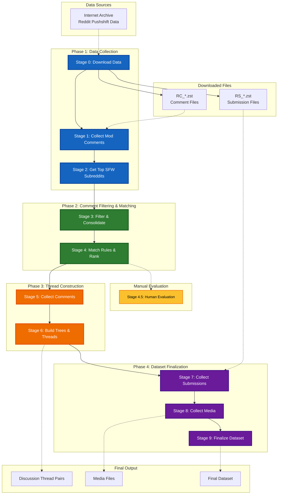

# Reddit Mod Collection Pipeline

A simple, DRY pipeline for collecting and processing Reddit moderation data. Transforms raw Pushshift archives into structured discussion thread pairs for analysis.

## Overview

This pipeline processes Reddit Pushshift data through 4 main phases:

**Phase 1: Data Collection** (Stages 0-2)
- Download Reddit Pushshift archives, extract moderator comments, identify target subreddits

**Phase 2: Comment Filtering & Matching** (Stages 3-4)
- Filter comments for target subreddits, match to rules using embeddings, rank by quality

**Phase 3: Thread Construction** (Stages 5-6)
- Collect submission comments, build comment trees and discussion thread pairs

**Phase 4: Dataset Finalization** (Stages 7-9)
- Collect submission metadata, download media files, create final structured dataset

## Pipeline Flow



## Quick Start

### 1. Environment Setup

**Option A: Automatic setup (recommended)**
```bash
# Run setup script (creates conda env or venv automatically)
./setup_env.sh

# Activate environment
conda activate reddit-mod-pipeline  # if conda was used
# OR
source venv/bin/activate  # if venv was used
```

**Option B: Manual setup**
```bash
# Create conda environment (recommended for ML dependencies)
conda create -n reddit-mod-pipeline python=3.10 -y
conda activate reddit-mod-pipeline
pip install -r requirements.txt

# OR create virtual environment
python3 -m venv venv
source venv/bin/activate
pip install -r requirements.txt
```

### 2. Configure and Run

```bash
# Edit paths in config.py if needed
# Then run full pipeline
python run_pipeline.py

# Or run individual stages
python run_pipeline.py 1  # Just mod comments collection
python scripts/1_collect_mod_comments.py  # Run directly
```

## Configuration

Edit `config.py` to set your paths:

```python
# Base directories - change these for your environment
BASE_DATA = "/N/scratch/zkachwal/reddit-mod-collection-pipeline"
REDDIT_DATA = "/N/project/cnets/datasets/reddit/comments_submissions"
```

All other paths are generated automatically based on the data flow.

## Pipeline Stages

| Stage | Script | Description | Key Outputs |
|-------|--------|-------------|-------------|
| 0 | `0_download_data.py` | Download Reddit Pushshift archives from Internet Archive | RC_*.zst, RS_*.zst |
| 1 | `1_collect_mod_comments.py` | Extract moderator comments from RC files | Mod comment rankings, filtered comments |
| 2 | `2_get_top_sfw_subreddits.py` | Identify top 1000 SFW subreddits with rules | Top subreddit list |
| 3 | `3_filter_and_consolidate.py` | Filter and consolidate mod comments for target subreddits | Consolidated subreddit files |
| 4 | `4_match_rules.py` | Match comments to rules using embeddings, rank by JSD | Matched comments, submission IDs |
| **4.5** | `4.5_human_evaluation.py` | Generate Google Forms for manual rule matching evaluation | Human evaluation survey |
| 5 | `5_collect_submission_comments.py` | Collect all comments for target submissions | Organized submission comments |
| 6 | `6_build_trees_and_threads.py` | Build comment trees and create discussion thread pairs | Comment trees, thread pairs |
| 7 | `7_collect_submissions.py` | Collect submission objects from discussion threads | Submission metadata |
| 8 | `8_collect_media.py` | Download media files for submissions | Downloaded media files |
| 9 | `9_finalize_dataset.py` | Create final structured dataset using discussion threads and media | Final dataset manifest |

## Manual Evaluation

Stage 4.5 provides a manual evaluation step to validate the quality of embedding-based rule matching:

```bash
# Run after Stage 4 completes
python scripts/4.5_human_evaluation.py
```

This creates a Google Form survey where human evaluators can:
- Review moderator comments and their matched rules
- Validate or correct the AI-generated rule matches
- Provide feedback on matching accuracy

**Note:** This is a quality assessment tool, not part of the main pipeline. The pipeline continues with Stage 5 regardless of evaluation results.

## Architecture

- **config.py** - Simple configuration with data flow mapping
- **utils/** - Shared utilities (file processing, Reddit helpers, ranking)
- **scripts/** - Individual pipeline stages (numbered 0-9)
- **run_pipeline.py** - Simple runner for full pipeline or individual stages

## Data Flow

Each stage produces specific outputs that feed into the next stage. The pipeline automatically creates the right directory structure and validates dependencies.

Key features:
- **Parallel processing** at subreddit level for scalability
- **Memory optimization** through streaming and temp files
- **Jensen-Shannon Divergence** ranking for subreddit quality
- **Integrated stages** to minimize I/O overhead
- **Comprehensive validation** and error handling

See `config.py DATA_FLOW` for complete mapping of inputs/outputs.