# Reddit Mod Collection Pipeline

A comprehensive pipeline for collecting and processing Reddit moderation data at scale. Transforms Arctic Shift (Pushshift subset, Dec 2005 - Feb 2023) into high-quality discussion thread pairs with LLM verification and semantic clustering.

## Overview

This pipeline processes Arctic Shift data (Pushshift subset, Dec 2005 - Feb 2023) through 4 main phases:

**Phase 1: Data Collection** (Stages 0-2)
- Download Arctic Shift from Academic Torrent, extract moderator comments from subreddit files, identify SFW subreddits with community rules using Reddit API

**Phase 2: Comment Filtering & Matching** (Stage 4)
- Match moderator comments to subreddit rules using semantic embeddings (Qwen3-Embedding-8B), compute global thresholds, rank by quality (JSD)

**Phase 3: Thread Construction** (Stages 5-6)
- Memory-optimized comment collection from Arctic Shift, build hierarchical comment trees, create moderated/unmoderated discussion thread pairs with extensive validation

**Phase 4: Dataset Finalization & Refinement** (Stages 7-10)
- Collect submission metadata from Arctic Shift, download media files, create train/val/test splits with LLM judge verification, assign semantic cluster labels

## Pipeline Flow

```mermaid
flowchart LR
    subgraph Sources ["Data Source"]
        S1["Academic Archive<br/>Pushshift<br/>Dec 2005 - Feb 2023"]
    end

    subgraph P1 ["Phase 1:<br/>Collection"]
        A["Stage 0<br/>Download"]:::phase1
        B["Stage 1<br/>Mod Comments"]:::phase1
        C["Stage 2<br/>SFW Filter"]:::phase1
        A --> B --> C
    end

    subgraph P2 ["Phase 2:<br/>Matching"]
        E["Stage 4<br/>Rule Matching<br/>Embeddings"]:::phase2
    end

    subgraph P3 ["Phase 3:<br/>Threads"]
        F["Stage 5<br/>Collect<br/>Comments"]:::phase3
        G["Stage 6<br/>Build Trees<br/>& Pairs"]:::phase3
        F --> G
    end

    subgraph P4 ["Phase 4:<br/>Finalization"]
        H["Stage 7<br/>Submissions"]:::phase4
        I["Stage 8<br/>Media"]:::phase4
        J["Stage 9<br/>Splits &<br/>LLM Verify"]:::phase4
        K["Stage 10<br/>Clusters"]:::phase4
        H --> I --> J --> K
    end

    subgraph Output ["Final Outputs"]
        O1["🗂️ Datasets<br/>Hydrated &<br/>Dehydrated"]
        O2["💬 Thread Pairs<br/>~100K"]
        O3["🏷️ Clusters<br/>Rule & Sub"]
        O4["🖼️ Media<br/>Images"]
    end

    S1 --> A
    C --> E
    E --> F
    G --> H
    K --> O1
    J --> O2
    G -.-> O3
    I -.-> O4

    classDef phase1 fill:#1565c0,stroke:#0d47a1,stroke-width:2px,color:#ffffff,font-size:12px
    classDef phase2 fill:#2e7d32,stroke:#1b5e20,stroke-width:2px,color:#ffffff,font-size:12px
    classDef phase3 fill:#ef6c00,stroke:#e65100,stroke-width:2px,color:#ffffff,font-size:12px
    classDef phase4 fill:#6a1b9a,stroke:#4a148c,stroke-width:2px,color:#ffffff,font-size:12px
    classDef default font-size:11px
```



## Quick Start

### 1. Environment Setup

**Option A: Automatic setup (recommended)**
```bash
# Run setup script (creates conda env or venv automatically)
./setup_env.sh

# Activate environment
conda activate reddit-mod-pipeline  # if conda was used
# OR
source venv/bin/activate  # if venv was used
```

**Option B: Manual setup**
```bash
# Create conda environment (recommended for ML dependencies)
conda create -n reddit-mod-pipeline python=3.10 -y
conda activate reddit-mod-pipeline
pip install -r requirements.txt

# OR create virtual environment
python3 -m venv venv
source venv/bin/activate
pip install -r requirements.txt
```

### 2. Configure and Run

```bash
# Edit paths in config.py if needed
# Then run full pipeline
python run_pipeline.py

# Or run individual stages
python run_pipeline.py 1  # Just mod comments collection
python scripts/1_collect_mod_comments.py  # Run directly
```

## Configuration

Edit `config.py` to set your paths:

```python
# Base directories - change these for your environment
BASE_DATA = "/N/scratch/zkachwal/reddit-mod-collection-pipeline"
REDDIT_DATA = "/N/project/cnets/datasets/reddit/comments_submissions"
```

All other paths are generated automatically based on the data flow.

## Pipeline Stages

| Stage | Script | Input | Description | Key Outputs |
|-------|--------|-------|-------------|-------------|
| **0** | `0_download_data.py` | Academic Torrent | Download Arctic Shift (Pushshift subset: Dec 2005 - Feb 2023) from Academic Torrent | Arctic Shift subreddit comment/submission files |
| **1** | `1_collect_mod_comments.py` | Arctic Shift subreddit comment files | Extract distinguished moderator comments from Arctic Shift, filter bots/AutoModerator, organize by subreddit | `{subreddit}_mod_comments.jsonl.zst`, ranking JSON |
| **2** | `2_get_top_sfw_subreddits.py` | Stage 1 rankings + Reddit API | Filter SFW subreddits with ≥200 mod comments and ≥2 community rules, collect rules and metadata | `sfw_subreddits_min_200_comments.json` with rules |
| **3** | *(Removed)* | - | Functionality merged into Stage 1 (direct subreddit organization) | - |
| **4** | `4_match_rules.py` | Stage 2 rules + Stage 1 comments | Phase 1: Create embedding-based similarity matrices (Qwen3-Embedding-8B) using CUDA buckets. Phase 2: Compute global thresholds (gold, ambiguous), apply matching with JSD ranking | `{subreddit}_match.jsonl.zst`, `matching_summary.json`, submission IDs |
| **5** | `5_collect_submission_comments.py` | Arctic Shift + Stage 4 submission IDs | Two-pass memory-optimized streaming: filter to temp file, deduplicate comments (preserve non-removed over removed), write pickle files. Peak memory: <1GB per worker | `organized_comments/{subreddit}/submission_{id}.pkl` |
| **6** | `6_build_trees_and_threads.py` | Stage 5 comments + Stage 4 matches | Build hierarchical comment trees, create moderated/unmoderated thread pairs with extensive validation (no removed/deleted, no media, no moderators, no edited mods) | `comment_trees/{subreddit}_comment_trees.pkl`, `discussion_threads/{subreddit}_discussion_threads.pkl` |
| **7** | `7_collect_submissions.py` | Arctic Shift submissions + Stage 6 threads | Collect submission metadata for all submissions in discussion thread pairs from Arctic Shift | `submissions/{subreddit}_submissions.zst` |
| **8** | `8_collect_media.py` | Stage 7 submissions | Download media files (images/thumbnails) with priority hierarchy: media_metadata > url > oembed > preview. Validates Content-Type, enforces 50MB limit, respects rate limits | `media/{subreddit}/{submission_id}_{media_id}.{ext}`, success tracking |
| **9** | `9_create_dehydrated_dataset.py` | Stages 6-8 + Stage 2 metadata | Load/filter submissions, filter thread pairs (Pushshift only: before Mar 1 2023), LLM judge verification (Qwen3-30B), adaptive train/val/test splits, shuffled answer options, create hydrated + dehydrated versions | `{split}_hydrated.json.zst`, `{split}_dehydrated.json.zst`, `test_hydrated.json` (uncompressed), stats |
| **10** | `10_assign_cluster_labels.py` | Stage 9 datasets + embedding analysis | Read cluster labels (TSV) from embedding clustering analysis, assign rule clusters and subreddit clusters to all thread pairs, create distribution visualizations (PNG/PDF) | `{split}_hydrated_clustered.json.zst`, `{split}_dehydrated_clustered.json.zst`, distribution plots |

## Key Features

### Semantic Matching & Quality Ranking
- **Embedding Model**: Qwen3-Embedding-8B for semantic similarity
- **Global Thresholds**: Computed from all similarity scores using percentiles (gold: 90th, ambiguous: 75th)
- **JSD Ranking**: Jensen-Shannon Divergence ranking for subreddit/rule quality (lower = better)
- **Ambiguous Filtering**: Rejects matches with multiple rules above ambiguous threshold

### Memory Optimization
- **Stage 5**: Two-pass streaming with <1GB peak memory per worker
  - Pass 1: Filter to temp file, count expected comments
  - Pass 2: Deduplicate and write (preserves non-removed over removed versions)
- **Stage 6**: Lazy loading of submission comments via ThreadPoolExecutor

### LLM-Based Verification
- **Stage 9**: Qwen3-30B judge verification
  - Verifies that mod comments actually cite matched rules
  - Conservative filtering: ambiguous responses marked as fail
  - Pass rate typically 85-95%

### Adaptive Data Splitting
- **Stage 9**: Subreddit-aware train/val/test splits:
  - n=1: (1,0,0) test/val/train
  - n=2: (1,0,1)
  - 3≤n<10: (1,1,n-2)
  - n≥10: (10%, 10%, 80%)
- Deterministic (stable hash) for reproducibility

### Dataset Formats
- **Hydrated**: Full submission objects and comment text (for direct use)
- **Dehydrated**: IDs and metadata only (for efficient distribution)
- **Multiple Splits**: Train/Val/Test datasets with full statistics

### Clustering & Visualization
- **Stage 10**: Rule clusters and subreddit clusters from embedding analysis
- **Visualizations**: Bar plots (PNG + PDF) showing cluster distributions
- **Metadata**: Cluster labels added to all thread pairs for analysis

## Architecture

```
reddit-mod-collection-pipeline/
├── config.py                          # Configuration + data flow paths
├── run_pipeline.py                    # Pipeline orchestrator
├── scripts/                           # Pipeline stages (0-10)
│   ├── 0_download_data.py
│   ├── 1_collect_mod_comments.py
│   ├── 2_get_top_sfw_subreddits.py
│   ├── 4_match_rules.py (Phase 1/2)
│   ├── 4_match_rules_bucket.py (CUDA worker)
│   ├── 5_collect_submission_comments.py
│   ├── 6_build_trees_and_threads.py
│   ├── 7_collect_submissions.py
│   ├── 8_collect_media.py
│   ├── 9_create_dehydrated_dataset.py
│   └── 10_assign_cluster_labels.py
├── utils/                             # Shared utilities
│   ├── files.py                       # ZST/JSON/pickle I/O, parallel processing
│   ├── logging.py                     # Worker-aware logging with emojis
│   ├── reddit.py                      # Reddit-specific helpers
│   └── stats.py                       # JSD, ranking, distribution analysis
├── analysis/                          # Post-pipeline analysis
│   ├── label_clusters.py              # Cluster embedding analysis (Stage 10 input)
│   └── regenerate_distribution_plots.py
└── data/                              # Output directory (auto-created)
    ├── stage{N}_*.json                # Statistics per stage
    ├── {split}_hydrated.json.zst      # Final datasets (hydrated)
    ├── {split}_dehydrated.json.zst    # Final datasets (dehydrated)
    ├── test_hydrated.json             # Uncompressed test set
    └── stage10_*_distribution.{png,pdf}  # Cluster visualizations
```

## Data Flow & I/O

Each stage produces outputs that feed into subsequent stages:

```
Academic Torrent
    ↓
Stage 0: Download Arctic Shift → subreddit comment/submission files
    ↓
Stage 1: Extract mod comments → {subreddit}_mod_comments.jsonl.zst
    ↓
Stage 2: Filter SFW + Reddit API → rules, metadata
    ↓
Stage 4: Semantic matching + embedding → matched_comments, submission IDs
    ├─ Phase 1: Create similarity matrices (CUDA buckets)
    └─ Phase 2: Global thresholds + matching
    ↓
Stage 5: Collect comments (memory-optimized)
    ├─ Pass 1: Filter to temp file
    └─ Pass 2: Deduplicate & write pickles
    ↓
Stage 6: Build trees & thread pairs (validation)
    ↓
Stage 7: Collect submissions from Arctic Shift
    ↓
Stage 8: Download media (images, thumbnails)
    ↓
Stage 9: Create train/val/test splits
    ├─ LLM judge verification (Qwen3-30B)
    ├─ Adaptive splits per subreddit
    └─ Hydrated + Dehydrated versions
    ↓
Stage 10: Assign cluster labels + visualize
    ↓
Final outputs: {train,val,test}_hydrated.json.zst + cluster distributions
```

## Performance Characteristics

- **Parallel Processing**: Subreddit-level parallelization (configurable workers)
- **Memory Efficiency**: Stage 5 limited to <1GB per worker via streaming
- **Scale**: Processes billions of comments, 100+ subreddits, ~100K final instances
- **Time**: Full pipeline typically takes 24-48 hours (varies by hardware/bandwidth)
- **Quality**: 85-95% LLM verification pass rate, high semantic coherence (JSD-ranked)

## Dependencies

- **Python 3.10+**
- **Core**: praw, tqdm, numpy, pandas, torch, vllm, transformers
- **Embeddings**: Qwen3-Embedding-8B (Stage 4)
- **LLM Judge**: Qwen3-30B-A3B-Instruct (Stage 9)
- **I/O**: zstandard, pickle
- **Analysis**: matplotlib, scikit-learn (optional for visualizations)