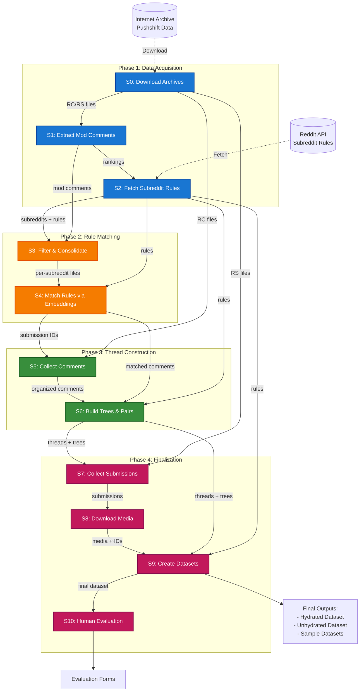

# Reddit Mod Collection Pipeline - Architecture Overview

A **4-phase, 11-stage pipeline** for collecting Reddit moderation data from Pushshift archives. Produces structured discussion thread pairs for analysis using **parallel processing**, **streaming compression**, **embedding-based rule matching**, and **comprehensive logging**.

---

## Pipeline Architecture



---

## Phase Overview

### Phase 1: Data Acquisition & Ranking (Stages 0-2)
**Purpose**: Download Reddit archives and identify top SFW subreddits with moderation activity

**Stages**:
- **Stage 0**: Download Pushshift archives from Internet Archive (RC/RS files)
- **Stage 1**: Extract moderator comments and rank subreddits by activity
- **Stage 2**: Fetch top N SFW subreddits with community rules via Reddit API

**Key Outputs**:
- RC/RS archives, mod comments, subreddit rankings, subreddit rules

**📖 Detailed Architecture**: See [PHASE1.md](./PHASE1.md)

---

### Phase 2: Rule Matching & Filtering (Stages 3-4)
**Purpose**: Match moderator comments to community rules using embeddings and rank subreddits by distribution quality

**Stages**:
- **Stage 3**: Filter and consolidate mod comments for target subreddits (3-phase: Filter → Consolidate → Cleanup)
- **Stage 4**: Match comments to rules using embeddings, apply global thresholds, rank by JSD (2-phase: Similarity Matrices → Global Matching)

**Key Outputs**:
- Per-subreddit mod comments, matched comments with rule assignments, similarity matrices, JSD rankings, submission IDs

**📖 Detailed Architecture**: See [PHASE2.md](./PHASE2.md)

---

### Phase 3: Thread Construction (Stages 5-6)
**Purpose**: Build comment trees and create moderated/unmoderated discussion thread pairs

**Stages**:
- **Stage 5**: Collect all comments for target submissions (3-phase: Filter → Consolidate → Cleanup)
- **Stage 6**: Build comment trees and create discussion thread pairs with BFS-based depth matching

**Key Outputs**:
- Organized submission comments, comment trees, discussion thread pairs, qualified subreddits (≥500 pairs)

**📖 Detailed Architecture**: See [PHASE3.md](./PHASE3.md)

---

### Phase 4: Finalization & Evaluation (Stages 7-10)
**Purpose**: Enrich dataset with submissions and media, create final datasets, setup human evaluation

**Stages**:
- **Stage 7**: Collect submission objects for discussion threads (3-phase: Extract IDs → Process RS files → Consolidate)
- **Stage 8**: Download media files using priority-based collection strategy
- **Stage 9**: Create final hydrated + unhydrated datasets (sample exactly 500 pairs/subreddit, rank by JSD)
- **Stage 10**: Setup human evaluation via Google Forms

**Key Outputs**:
- Submission objects, media files, final datasets (hydrated/unhydrated), evaluation forms

**📖 Detailed Architecture**: See [PHASE4.md](./PHASE4.md)

---

## Configuration (config.py)

### Key Constants
```python
# Base directories
BASE_DATA = "/data3/zkachwal/reddit-mod-collection-pipeline"
REDDIT_DATA = "/gpfs/slate-cnets/datasets/reddit/Pushshift"

# Processing settings
DATE_RANGE = ("2005-12", "2023-02")
TOP_N_SUBREDDITS_WITH_MOD_COMMENTS = 10000
GOLD_PERCENTILE = 99  # Top 1% similarity scores
AMBIGUOUS_PERCENTILE = 95  # Top 5% similarity scores
MIN_MATCHED_COMMENTS = FINAL_THREAD_PAIRS_PER_SUBREDDIT = 50
MAX_MATCHED_COMMENTS = 100
EMBEDDING_MODEL = "Qwen/Qwen3-Embedding-8B"
FINAL_SUBREDDITS = 100
PROCESSES = multiprocessing.cpu_count()
```

### Environment Variables
```python
os.environ['VLLM_WORKER_MULTIPROC_METHOD'] = 'spawn'  # Prevent SIGABRT
os.environ['VLLM_CONFIGURE_LOGGING'] = '0'
os.environ['PYTHONHASHSEED'] = '0'
```

### Data Flow Configuration
```python
DATA_FLOW = {
    'stage0_download_data': {
        'name': str,              # Stage name
        'script': str,            # Script filename
        'input_paths': List[str], # Input directories
        'input_files': List[str], # Input files
        'output_dir': str,        # Output directory
        'produces': List[str]     # Output files
    },
    # ... (stages 1-9)
}
```

### Utility Functions
```python
def _generate_paths() -> Dict[str, str]
    # Generate all paths based on base directories and data flow

def get_stage_info(stage_num: int) -> Dict[str, Any]
    # Get information for a specific stage number

def get_input_paths_for_stage(stage_num: int) -> List[str]
    # Get resolved input paths for a stage

def get_output_path_for_stage(stage_num: int) -> str
    # Get resolved output path for a stage

def create_directories() -> None
    # Create necessary output directories

def validate_stage_inputs(stage_num: int) -> Tuple[bool, str]
    # Check if inputs exist for a stage

def print_pipeline_status() -> None
    # Print status of entire pipeline
```

---

## Utilities (utils/)

### utils/files.py - File Processing

#### Compression & Streaming
```python
def read_and_decode(reader, chunk_size: int = 2**24,
                   max_window_size: int = 2**30,
                   previous_chunk: bytes = None,
                   bytes_read: int = 0) -> str
    # Recursively decompress and decode chunks with error handling

def process_zst_file(input_file: str, output_file: str,
                    line_processor: Callable[[str], bool],
                    progress_interval: int = 10_000_000,
                    logger = None) -> Dict[str, int]
    # Single-output streaming processor

def process_zst_file_multi(input_file: str,
                          line_processor: Callable[[str, Dict], Dict[str, Any]],
                          processor_state: Dict[str, Any],
                          progress_interval: int = 10_000_000,
                          logger = None) -> Dict[str, int]
    # Multi-output streaming processor with lazy-open writers
    # line_processor returns: {'matched': bool, 'output_files': List[str], 'data': Any}

def read_zst_lines(file_path: str, max_lines: int = None) -> List[str]
    # Read lines from compressed file

def write_zst_lines(file_path: str, lines: List[str],
                   level: int = 3, threads: int = 4)
    # Write lines to compressed file

def write_zst_json_objects(file_path: str, objects: List[Any],
                          level: int = 3, threads: int = 4)
    # Write JSON objects to compressed file
```

#### JSON Parsing
```python
# Priority: orjson > ujson > json
json_loads: Callable[[str], Any]
json_dumps: Callable[[Any], str]
json_dumps_pretty: Callable[[Any], str]
```

#### File Management
```python
def write_json_file(data: Any, file_path: str, pretty: bool = False)
    # Write data to JSON file

def read_json_file(file_path: str) -> Any
    # Read data from JSON file

def get_files_in_date_range(folder: str, prefix: str,
                           date_range: Tuple[str, str],
                           logger = None) -> List[str]
    # Get files matching prefix within date range (recursive search)

def process_files_parallel(files: List, process_func: Callable,
                          processes: int = None, logger = None) -> List[Any]
    # Process multiple files in parallel

def get_file_size_gb(file_path: str) -> float
    # Get file size in GB

def ensure_directory(file_path: str)
    # Ensure directory exists for a file path

def load_qualified_subreddits_from_stage6(logger = None) -> List[Dict[str, Any]]
    # Load full stats for qualified subreddits from Stage 6 summary (used by stages 7, 8, 9)
```

---

### utils/logging.py - Centralized Logging

```python
def setup_stage_logger(stage_name: str, log_level: str = "INFO",
                      worker_identifier: str = None) -> logging.Logger
    # Create stage-specific logger with main/worker separation

def get_stage_logger(stage_num: int, stage_description: str = None,
                    worker_identifier: str = None) -> logging.Logger
    # Get logger for a specific stage number

def log_stage_start(logger: logging.Logger, stage_num: int, stage_name: str)
    # Log the start of a pipeline stage

def log_stage_end(logger: logging.Logger, stage_num: int,
                 success: bool = True, elapsed_time: float = None)
    # Log the end of a pipeline stage

def log_progress(logger: logging.Logger, current: int, total: int,
                item_name: str = "items")
    # Log progress with percentage

def log_stats(logger: logging.Logger, stats_dict: dict,
             title: str = "Statistics")
    # Log statistics in formatted way

def log_error_and_continue(logger: logging.Logger, error: Exception,
                          context: str = "")
    # Log error but continue processing

def log_file_operation(logger: logging.Logger, operation: str,
                      file_path: str, success: bool = True)
    # Log file operations
```

**Logging Structure**:
```
logs/
├── stage1_collect_mod_comments/
│   ├── main_20250109_143022.log
│   └── RC_2023-02_20250109_143022.log
├── stage4_match_rules/
│   ├── main_20250109_150000.log
│   └── subreddits/
│       └── askreddit_20250109_150000.log
└── pipeline_runner/
    └── main_20250109_140000.log
```

---

### utils/reddit.py - Reddit Utilities

```python
def is_bot_or_automoderator(author: str) -> bool
    # Check if author is a bot or AutoModerator

def is_moderator_comment(comment: Dict[str, Any]) -> bool
    # Check if comment is distinguished moderator comment

def extract_submission_id(link_id: str) -> Optional[str]
    # Extract submission ID: "t3_abc123" -> "abc123"

def extract_comment_id(parent_id: str) -> Optional[str]
    # Extract comment ID: "t1_abc123" -> "abc123"

def normalize_subreddit_name(subreddit: str) -> str
    # Normalize to lowercase: "r/AskReddit" -> "askreddit"

def clean_rule_text(text: str) -> str
    # Remove HTML, markdown, URLs, prefixes, extra whitespace

def has_media(submission: Dict[str, Any]) -> bool
    # Check if submission contains media content

def validate_comment_structure(comment: Dict[str, Any]) -> bool
    # Validate comment has required fields

def validate_submission_structure(submission: Dict[str, Any]) -> bool
    # Validate submission has required fields

def filter_reddit_line(line: str, check_func: Callable) -> bool
    # Fast filtering with pre-check optimization

def build_subreddit_stats(comments: list) -> Dict[str, int]
    # Build statistics by subreddit from comments
```

---

### utils/stats.py - Statistics Utilities

```python
def calculate_jsd_from_uniform(distribution: Dict[str, int]) -> float
    # Calculate Jensen-Shannon Divergence from uniform distribution
    # Returns: 0.0 = perfectly uniform, 1.0 = maximum divergence

def rank_by_score(items: List[Dict], score_key: str,
                 ascending: bool = True,
                 filter_func: callable = None) -> List[Dict]
    # Generic ranking function by score field
    # Adds 'rank' field, filtered items get rank=999999

def analyze_rule_distribution(stats_list: List[Dict],
                             rule_matches_key: str = 'rule_matches') -> Dict
    # Analyze rule distribution across multiple datasets
    # Returns: {total_rules, rule_distribution, top_rules, total_matches}
```

---

## Data Structures Overview

### Comment Object
```python
{
    'id': str, 'author': str, 'body': str,
    'subreddit': str, 'created_utc': int,
    'parent_id': str, 'link_id': str,
    'distinguished': str, 'score': int
}
```

### Submission Object
```python
{
    'id': str, 'author': str, 'title': str,
    'selftext': str, 'url': str,
    'subreddit': str, 'created_utc': int,
    'score': int, 'num_comments': int,
    'is_video': bool, 'media_metadata': dict
}
```

### Rule Object
```python
{
    'rule_index': int,
    'short_name': str, 'description': str,
    'violation_reason': str,
    'short_name_clean': str, 'description_clean': str,
    'rule_comprehensive': str  # Combined for embeddings
}
```

### Matched Comment Object
```python
{
    # All Comment fields, plus:
    'matched_rule': {
        'rule_index': int,
        'short_name': str,
        'description': str,
        'similarity_score': float
    }
}
```

### Thread Pair Object
```python
{
    'mod_comment_id': str,
    'mod_comment': dict,  # Full comment object
    'submission_id': str,
    'matched_rule': dict,
    'rule_options': List[dict],  # Shuffled for evaluation
    'moderated_thread': List[dict],  # Full comment objects
    'unmoderated_thread': List[dict],  # Full comment objects
    'unmod_thread_metadata': dict
}
```

---

## Output Directory Structure

```
reddit-mod-collection-pipeline/
├── data/
│   ├── stage1_subreddit_mod_comment_rankings.json
│   ├── stage2_top_10000_sfw_subreddits.json
│   ├── stage3_filter_and_consolidate_summary.json
│   ├── stage4_matching_summary.json
│   ├── stage4_subreddit_submission_ids.json
│   ├── stage5_submission_comment_organization_stats.json
│   ├── stage6_trees_and_threads_summary.json
│   ├── stage7_submission_collection_stats.json
│   ├── stage8_media_collection_stats.json
│   ├── stage8_successful_submission_ids.json
│   ├── stage9_final_datasets_stats.json
│   ├── reddit_moderation_dataset_hydrated_v1.0.json.zst
│   ├── reddit_moderation_dataset_unhydrated_v1.0.json.zst
│   ├── reddit_moderation_dataset_hydrated_SAMPLE.json
│   ├── reddit_moderation_dataset_unhydrated_SAMPLE.json
│   ├── mod_comments/
│   │   └── RC_YYYY-MM_mod_comments.zst (208 files)
│   ├── top_subreddits/
│   │   └── {subreddit}_mod_comments.jsonl.zst
│   ├── submissions/
│   │   └── {subreddit}_submissions.zst
│   └── evaluation/
│       ├── stage9.5_human_evaluation_part1.json
│       ├── stage9.5_human_evaluation_part2.json
│       └── stage9.5_human_evaluation_summary.json
│
├── output/
│   ├── matched_comments/
│   │   ├── {subreddit}_similarity_matrix.pt
│   │   ├── {subreddit}_match.jsonl.zst
│   │   ├── {subreddit}_stats.json
│   │   └── cosine_similarity_distribution_all_percentiles.png
│   ├── organized_comments/
│   │   └── {subreddit}_submission_comments.pkl
│   ├── comment_trees/
│   │   ├── {subreddit}_comment_trees.pkl
│   │   └── {subreddit}_discussion_threads.pkl
│   ├── discussion_threads/
│   │   └── {subreddit}_discussion_threads.pkl (symlink)
│   ├── media/
│   │   └── {subreddit}/
│   │       ├── {submission_id}_{source}.{ext}
│   │       └── {submission_id}_{index}_{media_id}_{source}.{ext}
│   └── final_dataset/
│       └── (future: packaged releases)
│
└── logs/
    ├── stage0_download_data/
    ├── stage1_collect_mod_comments/
    ├── stage2_get_top_sfw_subreddits/
    ├── stage3_filter_and_consolidate/
    ├── stage4_match_rules/
    ├── stage5_collect_submission_comments/
    ├── stage6_build_trees_and_threads/
    ├── stage7_collect_submissions/
    ├── stage8_collect_media/
    ├── stage9_create_final_datasets/
    ├── stage9.5_human_evaluation/
    └── pipeline_runner/
```

---

## Key Design Patterns

### 1. DATA_FLOW Configuration Pattern
Single source of truth for pipeline dependencies with automatic path resolution.

### 2. Streaming Multi-Output Pattern
Lazy-open writers for memory-efficient multi-file output (Stages 3, 5, 7).

### 3. Worker Logger Pattern
Separate logs for main process and workers (per-file or per-subreddit).

### 4. Multi-Phase Architecture Pattern
- **Stage 3**: Filter → Consolidate → Cleanup (3-phase)
- **Stage 4**: Similarity Matrices → Global Thresholds (2-phase)
- **Stage 5**: Filter → Consolidate → Cleanup (3-phase)
- **Stage 7**: Extract IDs → Process RS files → Consolidate (3-phase)

**Benefits**: Avoids memory exhaustion, enables global statistics, fault tolerance

### 5. Subprocess Isolation Pattern
Spawns isolated subprocesses for vLLM (Stage 4) to avoid multiprocessing issues. Uses queue-based CUDA worker pool.

### 6. Fast Pre-Filter Pattern
String check before JSON parsing (Stage 1: 10x speedup).

### 7. In-Memory Statistics Collection
Collect statistics during streaming without re-reading files.

### 8. Deterministic Sampling
All random operations use fixed seeds (seed=0) for reproducibility.

---

## Usage

### Pipeline Orchestration
```bash
python run_pipeline.py status    # Show pipeline status
python run_pipeline.py           # Run full pipeline (0-9)
python run_pipeline.py 4         # Single stage
python run_pipeline.py 3 5       # Stage range
```

### Individual Stages
```bash
# Phase 1
python scripts/0_download_data.py
python scripts/1_collect_mod_comments.py
python scripts/2_get_top_sfw_subreddits.py

# Phase 2
python scripts/3_filter_and_consolidate.py
python scripts/4_match_rules.py                # Full two-phase
python scripts/4_match_rules.py --phase2-only  # Skip phase 1

# Phase 3
python scripts/5_collect_submission_comments.py
python scripts/6_build_trees_and_threads.py

# Phase 4
python scripts/7_collect_submissions.py
python scripts/8_collect_media.py
python scripts/9_create_unhydrated_dataset.py
python scripts/10_human_evaluation.py
```

---

*For detailed function signatures and phase-specific examples, see the individual phase documentation files.*
